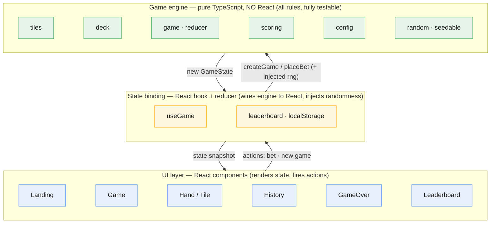
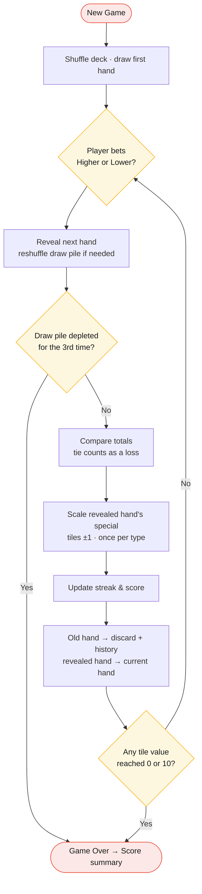

# Hand Betting Game — Technical Design Document

> A web-based "Higher or Lower" betting game played with Mahjong tiles.
> This document captures the rules, decisions, and architecture **before**
> implementation. It is the source of truth for the build.

---

## 1. Overview

The player is shown a **hand** of Mahjong tiles with a **total value**, then bets
whether the **next hand's total** will be **higher** or **lower**. Correct and
incorrect bets permanently change the value of the special tiles (Dragons/Winds),
so the deck's math drifts over the course of a session. The session ends when a
tile's value hits a boundary or the draw pile is exhausted too many times.

The project is built around three goals:

| Goal | How we address it |
|---|---|
| **Robust state management** | A single, pure, deterministic game engine (reducer) that owns all rules. |
| **UI polish** | Authentic tiles, smooth transitions, clear feedback, intuitive flow. |
| **Scalability / "feature-ready"** | Engine fully decoupled from UI; rules driven by a config object; new tile types/features added without touching the UI. |

---

## 2. Game Rules (resolved)

### 2.1 Tiles
Standard Mahjong set — **34 distinct types**, **4 copies each = 136 tiles**:

- **Number tiles** — 3 suits (Bamboo, Characters, Circles) × ranks 1–9 = 27 types
- **Wind tiles** — East, South, West, North = 4 types
- **Dragon tiles** — Red, Green, White = 3 types

### 2.2 Tile values
- **Number tiles:** value = face value (1–9), **fixed**.
- **Dragons & Winds:** start at **5**, and change dynamically (see below).

### 2.3 Dynamic scaling
When a hand is revealed and the bet is resolved:
- If it was a **winning** hand → every special tile in it **+1**.
- If it was a **losing** hand → every special tile in it **−1**.

### 2.4 A "hand"
A hand is **3 tiles** (configurable). Its **total** is the sum of its tile values.
The bet compares the next hand's total to the current hand's total.

### 2.5 Deck management
- Display the count of tiles in the **Draw Pile** and **Discard Pile**.
- When the draw pile cannot supply a full hand, **reshuffle**: take a fresh deck
  (136 tiles) + the discard pile, shuffle them together into a new draw pile.

### 2.6 Scoring
- **Streak-weighted.** A correct bet scores `base × current streak`
  (e.g. base 10 → 10, 20, 30, … for consecutive wins).
- A wrong bet **resets the streak** to 0.
- Final score feeds the **top-5 leaderboard**.

### 2.7 Game over
The session ends when **either**:
- **Any single tile-type value reaches 0 or 10**, or
- **The draw pile is depleted for the 3rd time.**

---

## 3. Key Decisions & Assumptions

The spec is intentionally underspecified. These are the decisions made, each
chosen to be **defensible and easy to change** (most are config flags).

| # | Ambiguity | Decision | Rationale |
|---|---|---|---|
| D1 | How many tiles per hand? | **3**, via `config.handSize` | "Total value" implies multiple tiles; configurable shows feature-readiness. |
| D2 | Is value "per tile type" or "per physical copy"? | **Per type** — all copies of a tile share one value | Cleaner economy; makes the 0/10 game-over meaningful; matches "specific to that tile." |
| D3 | Which hand scales on win/loss? | The **newly revealed** hand | It is the hand the bet resolves against. |
| D4 | A special tile appears twice in one hand — scale once or twice? | **Once per type per hand** | Value is per-type; avoids surprising double jumps. |
| D5 | Tie (next total == current total)? | **Counts as a loss** (`config.tieIsLoss`) | Keeps the value economy moving; switchable to a "push" via config. |
| D6 | What value does the *current* hand show after a reveal? | The **post-scaling** value | The displayed total must reflect live values used by the next bet. |
| D7 | Scoring rule (unspecified)? | **Streak-weighted** | Rewards skill, makes the leaderboard interesting. |
| D8 | Leaderboard storage? | **`localStorage`** | No backend required by the spec; keeps the project self-contained. |
| D9 | "Draw pile runs out for the 3rd time"? | 1st & 2nd depletion → reshuffle; **3rd depletion → game over** | Literal reading of the requirement. |
| D10 | How many number-tile suits? (not specified) | **3 suits** (Bamboo, Characters, Circles), 1–9 | Matches the authentic 136-tile Mahjong set for visual variety. Suit has no effect on value/logic, so this is purely a presentation + deck-size choice (easily reduced via `tiles.ts`). |
| D11 | Model dynamic-ness as a hardcoded category, or a per-type policy? | **Per-type value policy** (`static` / `dynamic`); default = spec behavior | Removes the number-vs-special asymmetry. Making *any* tile dynamic (or static) becomes a data change, not engine surgery — directly serves the "feature-ready" goal.  |

---

## 4. Architecture

The guiding principle: **the rules live in a pure engine that knows nothing about
React or the DOM.** The UI is a thin, replaceable layer that renders engine state
and dispatches actions.



**Why this matters:** adding a feature (e.g. a new tile type, a power-up, a
different scoring rule, a multiplier tile) is done in the engine and covered by
unit tests — independent of and without breaking the UI.

### 4.1 Proposed file structure
```
hand-betting-game/
├─ src/
│  ├─ engine/                          # Pure game logic (no React, fully testable)
│  │  ├─ config.ts                      # Tunable rules (hand size, base value, limits)
│  │  ├─ random.ts                      # Seedable PRNG (deterministic tests)
│  │  ├─ tiles.ts                       # Tile types, identities, value lookup
│  │  ├─ deck.ts                        # Build deck, shuffle, draw
│  │  ├─ scoring.ts                     # Streak-weighted scoring
│  │  ├─ game.ts                        # Pure reducer: createGame(), placeBet()
│  │  └─ engine.test.ts                 # Unit tests for the rules
│  │
│  ├─ state/                           # React binding layer
│  │  ├─ useGame.ts                     # Hook wiring the engine to React
│  │  └─ leaderboard.ts                 # localStorage persistence (top 5)
│  │
│  ├─ components/                      # UI components
│  │  ├─ Landing.tsx                    # Landing page (New Game + Leaderboard)
│  │  ├─ Game.tsx                       # Gameplay screen
│  │  ├─ Hand.tsx                       # Current hand + total value
│  │  ├─ Tile.tsx                       # Single tile visual
│  │  ├─ History.tsx                    # Previous-hands strip
│  │  ├─ GameOver.tsx                   # End-of-game score summary
│  │  └─ Leaderboard.tsx                # Top-5 high scores
│  │
│  ├─ index.css                        # Tailwind v4 entry (@import) + @theme tokens
│  ├─ App.tsx                          # Root component / screen routing
│  └─ main.tsx                         # App entry point
│
├─ docs/                              # Project documentation
│  └─ technical-design.md              # This document
│
├─ index.html                         # Vite HTML entry
├─ package.json
├─ tsconfig.json                      # TypeScript config (strict)
├─ vite.config.ts                     # Vite + React + Tailwind plugins, Vitest setup
└─ README.md
```

---

## 5. Core Data Model

- **TileType** — one of the 34 identities (e.g. `dragon:red`, `number:bamboo:3`).
- **Tile** — a physical instance drawn from the deck (`uid` + its `typeId`).
- **ValuePolicy** — declares *how* a tile type's value behaves.
- **ValueMap** — `typeId → current value` for every **dynamic** tile type.
- **GameState** — the full snapshot: piles, current hand + total, history,
  value map, score, streak, round, depletion count, phase, last outcome.

The engine is a set of **pure functions** over `GameState`:
`createGame(rng, config)` and `placeBet(state, bet, rng)` — each returns a new
state, never mutating the old one. Randomness is **injected** (not called
internally) so tests are fully deterministic.

### 5.1 Value model (the extensibility seam)

Rather than hardcoding "numbers are static, specials are dynamic," each tile type
carries a **value policy**. Whether a tile's value can change is therefore
**data**, not branching logic:

```ts
type ValuePolicy =
  | { kind: 'static' }                              // value = base, never changes
  | { kind: 'dynamic'; min: number; max: number };  // drifts ±1, bounded (game-over at min/max)
```

**Default policies (match the spec exactly):**

| Tile type | Base value | Policy |
|---|---|---|
| Number (1–9) | face value | `static` |
| Dragon | 5 | `dynamic` (min 0, max 10) |
| Wind | 5 | `dynamic` (min 0, max 10) |

A single `tileValue(typeId, state)` function resolves any tile's value, and the
win/loss scaling step only asks *"is this type's policy dynamic?"* — it no longer
cares whether the tile is a number, dragon, or wind. The 0/10 game-over check
likewise follows the policy's `min`/`max`, so it generalizes automatically.

**Why:** making any tile dynamic (e.g. "now the 9s change too") becomes a one-line
policy change in data, covered by the existing tests — with **zero** changes to the
reducer or UI. Default behavior remains exactly what the spec requires.

---

## 6. Round Flow



**Step by step:**

1. **Start:** shuffle a deck, draw the first hand → it becomes the current hand.
2. **Bet:** player picks Higher or Lower.
3. **Reveal:** draw the next hand (reshuffling if needed).
4. **Resolve:** compare totals → win/loss (tie = loss).
5. **Scale:** apply ±1 to the revealed hand's **dynamic** tiles (Dragons/Winds by default), once per type.
6. **Score:** update streak and score.
7. **Archive:** old hand → discard pile + history strip; revealed hand becomes current.
8. **Check game over:** any value at 0/10, or 3rd depletion.
9. Repeat from step 2 until game over → show score summary → offer to save score.

---

## 7. Testing Strategy

Because the engine is pure and randomness is injected, the rules are unit-tested
with a **seeded RNG**:

- Deck composition (exactly 136 tiles, correct type counts).
- Number value = face; special value = 5 at start.
- Win increments / loss decrements the right tiles, once per type.
- Reshuffle merges discard + fresh deck when the draw pile can't supply a hand.
- Game over fires on tile-limit (0/10) and on the 3rd depletion.

UI is verified manually in the browser.

---

## 8. Extensibility Notes

The design anticipates extension along these seams:

- **New tile types** → add to `TILE_TYPES`; the deck, values, and UI follow automatically.
- **Make any tile dynamic/static** → change its **value policy** — e.g. let number tiles drift too — with no reducer or UI changes.
- **Rule tweaks** (hand size, base value, limits, tie handling, score base) → change `config`, no code edits.
- **New scoring models** → swap `scoring.ts`.
- **New game-over conditions** → add a check in the reducer's resolve step.
- **Persistence/backend** → `leaderboard.ts` is the single seam; swap localStorage for an API.
- **Animations/themes** → isolated to the UI layer; engine is untouched.

---

## 9. Tech Stack

**Frontend**
- **React 18 + TypeScript** — typed components; binds to the pure engine.
- **Vite** — fast dev server, HMR, zero-config TypeScript.
- **Tailwind CSS (v4)** — utility-first styling with a custom theme (design tokens
  via `@theme` in `index.css`) for consistent spacing, colors, and the tile look.
- **Framer Motion** — smooth, declarative transitions (tile deals, flips, value
  changes) for polish.

**State**
- **`useReducer` + Context** wrapping the pure engine — no external state library;
  the engine owns the rules, React just binds to it.

**Tiles**
- **Unicode Mahjong glyphs** framed with Tailwind, with a live value badge — no
  image assets, fully styleable.

**Tooling & persistence**
- **Vitest** — fast unit tests for the engine.
- **localStorage** — leaderboard persistence (top 5), no backend.
